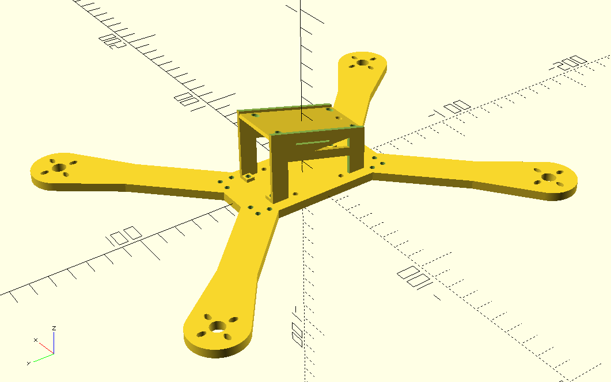
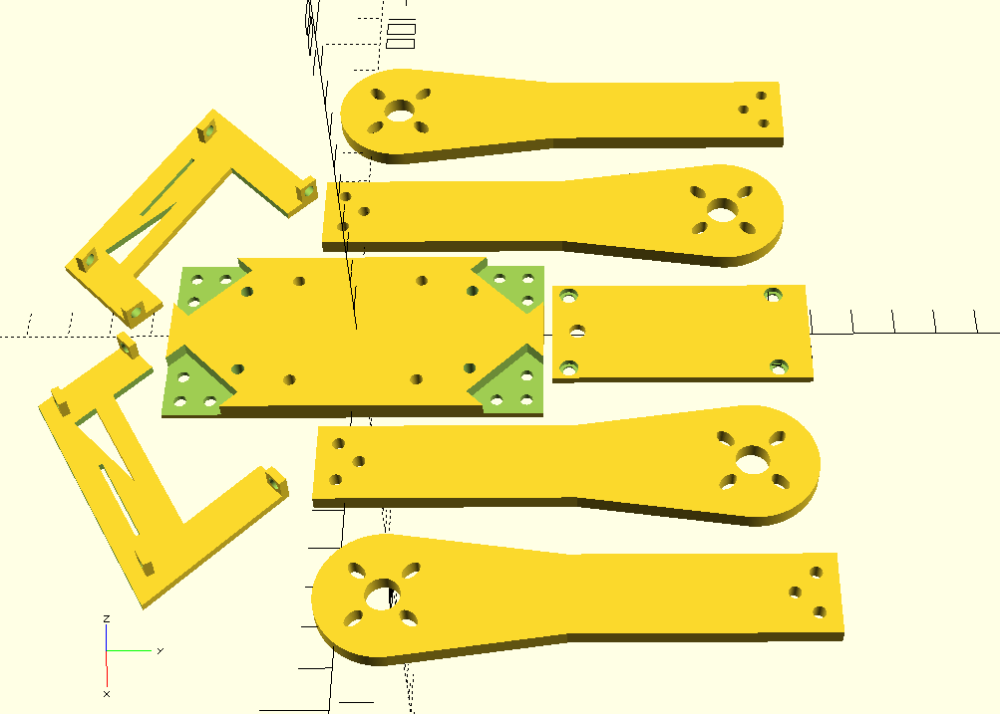
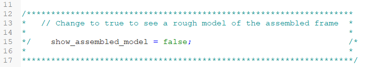
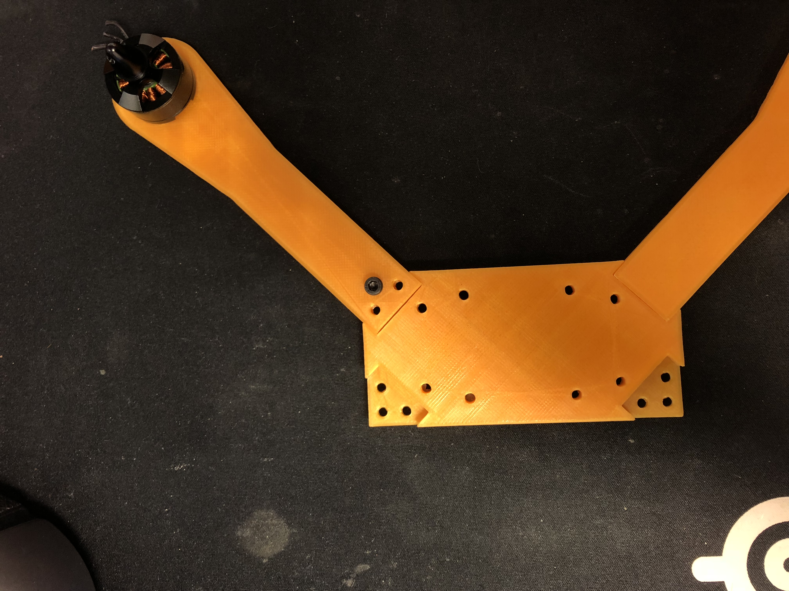
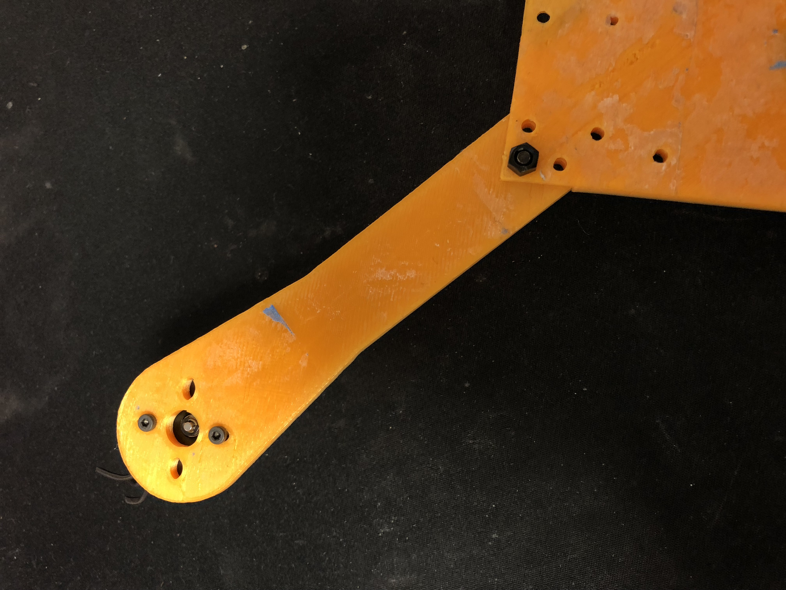

# The Leviathan Racing Quad
#### (work in progress)
This racing frame is a hybrid cross between standard 200mm and 250mm quad frames. It features a compact central enclosure with abnormally long wings that are attached to the body via snap-in divots and m3 screws. The current OpenSCAD file allows partial modification to the frame in terms of body and wing sizing, but further refactorings will make the frame completely modular.

Figure 1: Complete Frame

Figure 2: Disassembled Frame

## Printing
STLs of each frame component are available in ./STLs. There are two options for printing the frame:

1) Print each component separately
2) Print the entire disassembled version all at once

#### STLs:

## OpenSCAD - droneFrame.scad

Figure 3: Toggle Assembled/Disassembled View

## Customization
The OpenSCAD files for the complete model (droneFrame.scad) and the wing (arm.scad) have variables at the top of each file that can modify the overall structure of the frame. Further customization options will be added later such as the ability to change the wing angle from the body.

## Replacing Parts
Crashes usually result in a broken or several broken wings. For this reason, the wings are disjoint from the body so in case of a crash only the wing (as opposed to the whole frame base) needs to be reprinted. Similar reasoning was used in designed the body enclosure, but these components break less frequently than the wings.

## Draft 3D Prints
Here are a few of my first 3D prints with this frame:

Figure 4: 3D Print Front

Figure 5: 3D Print Back
